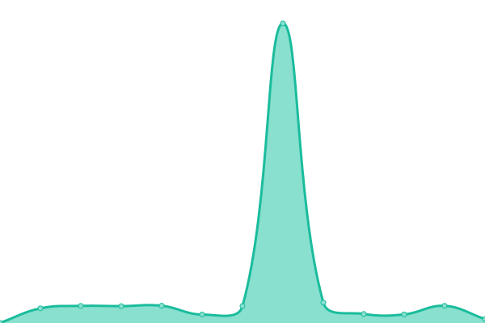
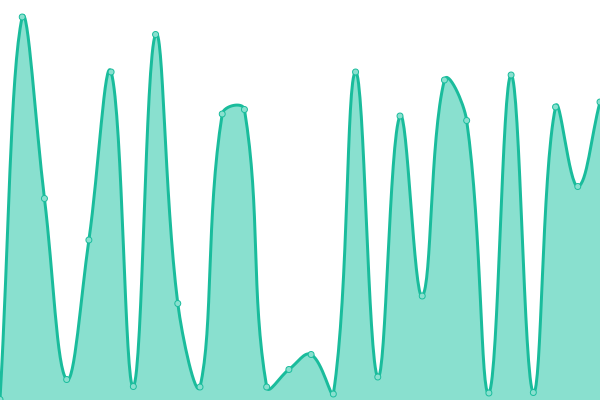
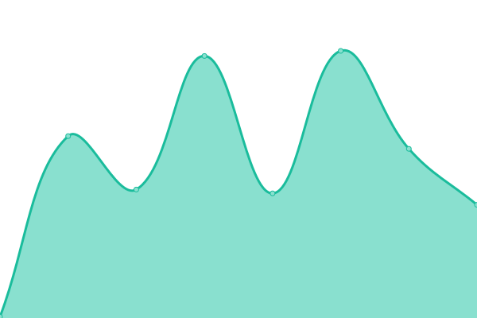

# [📈 Live Status](https://upptime.gildlab.xyz): <!--live status--> **🟩 All systems operational**

This repository contains the open-source uptime monitor and status page for [gildlab](https://upptime.gildlab.xyz), powered by [Upptime](https://github.com/upptime/upptime).

With [Upptime](https://upptime.js.org), you can get your own unlimited and free uptime monitor and status page, powered entirely by a GitHub repository. We use [Issues](https://github.com/gildlab/upptime/issues) as incident reports, [Actions](https://github.com/gildlab/upptime/actions) as uptime monitors, and [Pages](https://upptime.gildlab.xyz) for the status page.

<!--start: status pages-->
<!-- This summary is generated by Upptime (https://github.com/upptime/upptime) -->
<!-- Do not edit this manually, your changes will be overwritten -->
<!-- prettier-ignore -->
| URL | Status | History | Response Time | Uptime |
| --- | ------ | ------- | ------------- | ------ |
|  [DA B 2](https://gildlab-ipfs-5.eu.ngrok.io/api/v0/version) | 🟩 Up | [da-b-2.yml](https://github.com/gildlab/upptime/commits/HEAD/history/da-b-2.yml) | 

 456ms
     
 | 

<a href="https://upptime.gildlab.xyz/history/da-b-2">100.00%</a>
    

|  [N B](https://gildlab-ipfs-4.eu.ngrok.io/api/v0/version) | 🟩 Up | [n-b.yml](https://github.com/gildlab/upptime/commits/HEAD/history/n-b.yml) | 

 921ms
     
 | 

<a href="https://upptime.gildlab.xyz/history/n-b">100.00%</a>
    

|  [DA B 1](https://gildlab-ipfs-2.eu.ngrok.io/api/v0/version) | 🟩 Up | [da-b-1.yml](https://github.com/gildlab/upptime/commits/HEAD/history/da-b-1.yml) | 

 449ms
     
 | 

<a href="https://upptime.gildlab.xyz/history/da-b-1">100.00%</a>
    

|  [V B](https://gildlab-ipfs-0.in.ngrok.io/api/v0/version) | 🟩 Up | [v-b.yml](https://github.com/gildlab/upptime/commits/HEAD/history/v-b.yml) | 

 736ms
     
 | 

<a href="https://upptime.gildlab.xyz/history/v-b">96.85%</a>
    

|  [Some hash](https://ipfs.io/ipfs/QmYVXD6CCYEC7y5jz2rTkadiqFcDby3Xoy4q4x6RGXCAUN) | 🟩 Up | [some-hash.yml](https://github.com/gildlab/upptime/commits/HEAD/history/some-hash.yml) | 

 88ms
     
 | 

<a href="https://upptime.gildlab.xyz/history/some-hash">94.40%</a>
    

|  [stf website](https://sft.gildlab.xyz) | 🟩 Up | [stf-website.yml](https://github.com/gildlab/upptime/commits/HEAD/history/stf-website.yml) | 

 339ms
     
 | 

<a href="https://upptime.gildlab.xyz/history/stf-website">100.00%</a>
    

|  [gl website](https://gildlab.xyz) | 🟩 Up | [gl-website.yml](https://github.com/gildlab/upptime/commits/HEAD/history/gl-website.yml) | 

 1255ms
     
 | 

<a href="https://upptime.gildlab.xyz/history/gl-website">100.00%</a>
    

<!--end: status pages-->

[**Visit our status website →**](https://upptime.gildlab.xyz)

## 📄 License

- Powered by: [Upptime](https://github.com/upptime/upptime)
- Code: [MIT](./LICENSE) © [gildlab](https://upptime.gildlab.xyz)
- Data in the `./history` directory: [Open Database License](https://opendatacommons.org/licenses/odbl/1-0/)
