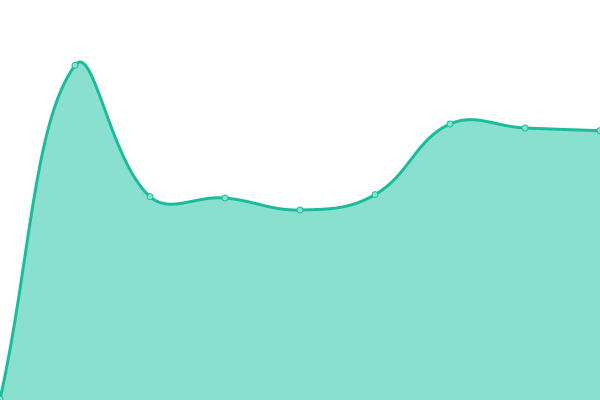

# [📈 Live Status](https://upptime.gildlab.xyz): <!--live status--> **🟧 Partial outage**

This repository contains the open-source uptime monitor and status page for [gildlab](https://upptime.gildlab.xyz), powered by [Upptime](https://github.com/upptime/upptime).

With [Upptime](https://upptime.js.org), you can get your own unlimited and free uptime monitor and status page, powered entirely by a GitHub repository. We use [Issues](https://github.com/gildlab/upptime/issues) as incident reports, [Actions](https://github.com/gildlab/upptime/actions) as uptime monitors, and [Pages](https://upptime.gildlab.xyz) for the status page.

<!--start: status pages-->
<!-- This summary is generated by Upptime (https://github.com/upptime/upptime) -->
<!-- Do not edit this manually, your changes will be overwritten -->
<!-- prettier-ignore -->
| URL | Status | History | Response Time | Uptime |
| --- | ------ | ------- | ------------- | ------ |
|  [N B](https://gildlab-ipfs-4.eu.ngrok.io/api/v0/version) | 🟥 Down | [n-b.yml](https://github.com/gildlab/upptime/commits/HEAD/history/n-b.yml) | 

 390ms
     
 | 

<a href="https://upptime.gildlab.xyz/history/n-b">0.02%</a>
    

|  [DM L](https://gildlab-ipfs-3.eu.ngrok.io/api/v0/version) | 🟩 Up | [dm-l.yml](https://github.com/gildlab/upptime/commits/HEAD/history/dm-l.yml) | 

 702ms
     
 | 

<a href="https://upptime.gildlab.xyz/history/dm-l">53.37%</a>
    

|  [DA B](https://gildlab-ipfs-2.eu.ngrok.io/api/v0/version) | 🟩 Up | [da-b.yml](https://github.com/gildlab/upptime/commits/HEAD/history/da-b.yml) | 

 407ms
     
 | 

<a href="https://upptime.gildlab.xyz/history/da-b">100.00%</a>
    

|  [N L](https://gildlab-ipfs-1.eu.ngrok.io/api/v0/version) | 🟥 Down | [n-l.yml](https://github.com/gildlab/upptime/commits/HEAD/history/n-l.yml) | 

 380ms
     
 | 

<a href="https://upptime.gildlab.xyz/history/n-l">0.02%</a>
    

|  [V B](https://gildlab-ipfs-0.in.ngrok.io/api/v0/version) | 🟥 Down | [v-b.yml](https://github.com/gildlab/upptime/commits/HEAD/history/v-b.yml) | 

 825ms
     
 | 

<a href="https://upptime.gildlab.xyz/history/v-b">16.84%</a>
    

<!--end: status pages-->

[**Visit our status website →**](https://upptime.gildlab.xyz)

## 📄 License

- Powered by: [Upptime](https://github.com/upptime/upptime)
- Code: [MIT](./LICENSE) © [gildlab](https://upptime.gildlab.xyz)
- Data in the `./history` directory: [Open Database License](https://opendatacommons.org/licenses/odbl/1-0/)
